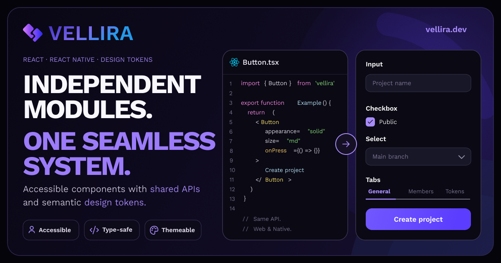

<p align="center">
  
</p>

# Vellira

<p align="center">
  
</p>

<p align="center">
  <strong>Build once. Stay consistent everywhere.</strong><br/>
  Build consistent interfaces for <strong>React</strong> and <strong>React Native</strong> with shared design tokens, reusable interaction logic, and platform-native components.
</p>

<p align="center">
MIT Licensed • TypeScript-first • Open Source
</p>

<p align="center">
Accessibility-minded • Cross-platform • Modular
</p>

<p align="center">
  <a href="https://vellira.dev">Website</a>
  •
  <a href="https://docs.vellira.dev">Documentation</a>
  •
  <a href="https://storybook.vellira.dev">Storybook</a>
  •
  <a href="https://github.com/vellira-dev/vellira">GitHub</a>
</p>

<p align="center">

[](https://www.bestpractices.dev/projects/14078)
[](https://www.npmjs.com/package/@vellira-ui/react)
[](https://www.npmjs.com/package/@vellira-ui/react)
[](https://github.com/vellira-dev/vellira/actions/workflows/ci.yml)
[](https://securityscorecards.dev/viewer/?uri=github.com/vellira-dev/vellira)


</p>

---

## What is Vellira?

Vellira is an open-source cross-platform design system for React and React Native.

It combines shared design tokens, reusable interaction logic and platform-native components into a consistent developer experience.

---

## Why Vellira?

Most design systems stop at components.

Vellira goes further by providing a shared foundation for building consistent interfaces across React and React Native.

Instead of duplicating design decisions across platforms, Vellira shares:

- 🎨 Design Tokens
- ⚡ TypeScript Contracts
- 🧠 Interaction Logic
- 🧩 Consistent Component APIs

Each platform still gets its own native implementation, ensuring familiar behavior without sacrificing consistency.

---

## Why developers choose Vellira

- Shared design tokens across Web and React Native
- Consistent APIs on both platforms
- Accessibility-minded component APIs
- TypeScript-first developer experience
- Modular packages with tree-shaking support
- Interactive documentation and Storybook
- Automated testing and release pipeline

---

## Features

### 🌐 Cross-platform

- Shared APIs for React and React Native
- Platform-specific implementations

### ⚡ Developer Experience

- TypeScript-first APIs
- Tree-shakeable packages
- Practical documentation
- Predictable component architecture

### 🎨 UI

- Accessibility-minded components
- CSS Variables
- Shared Design Tokens
- Interactive Storybook

### 🛡️ Quality

- Automated testing
- Semantic Release
- Continuous Integration
- Public API validation

---

## Installation

### React

**pnpm**

```bash
pnpm add @vellira-ui/react
```

**npm**

```bash
npm install @vellira-ui/react
```

**yarn**

```bash
yarn add @vellira-ui/react
```

---

### React Native

```bash
pnpm add @vellira-ui/react-native
```

---

### Design Tokens

```bash
pnpm add @vellira-ui/tokens
```

---

## Quick Example

Import the React styles and render your first Vellira component:

```tsx
import '@vellira-ui/react/styles';
import { Button } from '@vellira-ui/react';

export function App() {
  return <Button color='primary'>Continue</Button>;
}
```

Explore the [Documentation](https://docs.vellira.dev) for complete guides and the [Storybook](https://storybook.vellira.dev) for interactive component examples.

Want a practical cross-platform walkthrough? Read [Building a Cross-Platform Form with Vellira](https://vellira.dev/blog/cross-platform-form-vellira) to see FormField, Input, Select, Checkbox, and Button composed for React and React Native.

### More complete example

The compound Select API shows a richer component with labels, descriptions, groups, badges, and clearable state:

```tsx
import '@vellira-ui/react/styles';
import { Select } from '@vellira-ui/react';

export function ReleaseTeamSelect() {
  return (
    <Select
      label='Release owner'
      description='Assign the team responsible for the next rollout.'
      placeholder='Choose a team'
      defaultValue='frontend-platform'
      color='primary'
      variant='outline'
      clearable
    >
      <Select.Group label='Core teams'>
        <Select.Item
          value='design-systems'
          label='Design Systems'
          description='Components, tokens and accessibility reviews'
          badge='Core'
        />
        <Select.Item
          value='frontend-platform'
          label='Frontend Platform'
          description='Build tooling, docs and release quality'
          badge='Web'
        />
      </Select.Group>

      <Select.Separator />

      <Select.Group label='Operations'>
        <Select.Item
          value='customer-support'
          label='Customer Support'
          description='Escalations, feedback and adoption notes'
          badge='CS'
        />
      </Select.Group>
    </Select>
  );
}
```

---

## Docker Development

Install dependencies:

```bash
pnpm docker:install
```

Start the website:

```bash
pnpm docker:website
```

Start Storybook:

```bash
pnpm docker:storybook
```

Start the documentation:

```bash
pnpm docker:docs
```

Run Playwright:

```bash
pnpm docker:test
```

Open a shell:

```bash
pnpm docker:shell
```

Stop everything:

```bash
pnpm docker:down
```

### Visual Regression Tests

Run Playwright visual tests inside the Linux container:

```bash
pnpm docker:e2e
```

Update snapshots:

```bash
pnpm docker:e2e:update
```

---

## Packages

| Package                    | Purpose                            |
| -------------------------- | ---------------------------------- |
| `@vellira-ui/react`        | UI components for React            |
| `@vellira-ui/react-native` | UI components for React Native     |
| `@vellira-ui/tokens`       | Design tokens                      |
| `@vellira-ui/core`         | Shared hooks and interaction logic |
| `@vellira-ui/icons`        | SVG icon library                   |
| `@vellira-ui/types`        | Shared TypeScript definitions      |

---

## Components

<!-- vellira:component-inventory:start -->

Platform availability is derived from the canonical component metadata registry.

> `Portal` and `PortalProvider` are support primitives used by overlay components. They are public package infrastructure, not canonical catalog components.

| Component  | React | React Native |
| ---------- | :---: | :----------: |
| Accordion  |  ✅   |      ✅      |
| Button     |  ✅   |      ✅      |
| Checkbox   |  ✅   |      ✅      |
| Dropdown   |  ✅   |      ✅      |
| FormField  |  ✅   |      ✅      |
| Input      |  ✅   |      ✅      |
| Modal      |  ✅   |      ✅      |
| Popover    |  ✅   |      ✅      |
| Radio      |  ✅   |      ✅      |
| RadioGroup |  ✅   |      ✅      |
| Select     |  ✅   |      ✅      |
| Switch     |  ✅   |      ✅      |
| Tabs       |  ✅   |      ✅      |
| Tooltip    |  ✅   |      ✅      |

<!-- vellira:component-inventory:end -->

---

## Philosophy

Vellira is built around a few simple principles.

### Shared foundations

Share tokens, logic and APIs across platforms.

### Native experiences

Each platform should feel native instead of being forced into a one-size-fits-all solution.

### Developer Experience

Strong typing, modular packages, clear documentation and predictable APIs.

### Accessibility

Keyboard navigation, focus management and accessible APIs are considered from the beginning.

---

## Documentation

Everything you need to get started:

- Getting Started
- Installation
- Components
- Design Tokens
- API Reference
- Production Guide
- Examples

📖 **[Documentation](https://docs.vellira.dev)**

Complete guides, API references and examples.

---

## Storybook

Explore every component interactively.

📖 **[Storybook](https://storybook.vellira.dev)**

---

## Roadmap

The first public release is just the beginning.

Upcoming work includes:

- More components
- React Native expansion
- Advanced data entry components
- Starter templates
- Figma resources
- More design tokens
- AI-powered developer tools
- Performance optimizations

---

## Contributing

Contributions, issues and ideas are always welcome.

If you'd like to improve Vellira, feel free to open an issue or submit a pull request.

---

## Community

- 🌐 **[Website](https://vellira.dev)**
- 📚 **[Documentation](https://docs.vellira.dev)**
- 📖 **[Storybook](https://storybook.vellira.dev)**
- 🐞 **[Report an Issue](https://github.com/vellira-dev/vellira/issues)**
- 💬 **[Join Discussions](https://github.com/vellira-dev/vellira/discussions)**
- 🤝 **[Contributing Guide](./CONTRIBUTING.md)**
- ⭐ **[Star on GitHub](https://github.com/vellira-dev/vellira)**

---

## Browser Support

Vellira supports modern evergreen browsers and actively maintained versions of React and React Native.

See the documentation for compatibility details.

---

Built by Roman Bakurov.

If Vellira helps you build better interfaces, consider starring the repository on GitHub.

Every star helps the project reach more developers.

---

## License

MIT (c) Roman Bakurov
